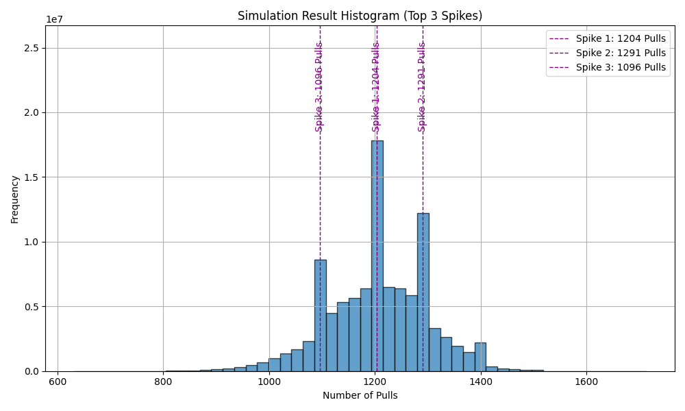
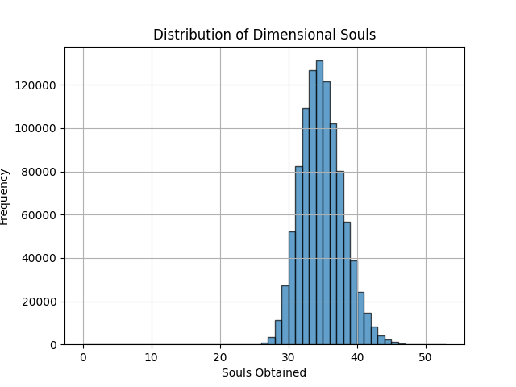

# AFK Arena Dimensional Pull Simulator

This is a simulation tool for the mobile game **AFK Arena**.  
It estimates how many **destiny scrolls (pulls)** you'll need to collect a specified number of **dimensional hero souls**, using realistic mechanics like:

- **2% drop rate**
- **Pity counter (guaranteed pull every 60)**
- **Milestone soul bonuses at fixed intervals**

---

## Features

- Supports **single and dual hero** simulations  
- Simulates how many pulls you need for souls, or how many souls you get from your pulls  
- Statistical summary: **best**, **worst**, and **average**  
- Highlights top 3 most likely pull outcomes (**spikes**)  
- Multiprocessing for speed  
- Real-time **progress bar** with `tqdm`  
- Graphical output via **matplotlib**

---

## Required Python Packages

Install the following Python packages using `pip`:

```bash
pip install numpy matplotlib tabulate scipy tqdm
```
---
### How to Run
1. Clone the repository to your local machine.
2. Ensure you have Python 3.x installed.
3. Install the required Python packages as listed above.

You will be prompted to:
- Select simulation mode:  
    1 = Target Souls (you choose how many souls you want)  
    2 = Fixed Pulls (you input how many scrolls/diamonds you have)
- Enter number of heroes (1 or 2)
- Enter number of souls required
- Set the number of simulations (e.g., 100000 for better accuracy)

---

## Example Outputs
### Mode 1: Target Souls Mode
This mode calculates how many pulls are needed to collect 46 dimensional hero souls,
also enough souls for both heroes to reach Ascended 5*.  

**Settings:**
- 46 total souls (e.g., 2 heroes with 23 each)
- 100,000,000 simulations

**Output:** 

| Spike              | Pulls | Diamond Cost | Souls |
|--------------------|:-----:|:------------:|:-----:|
| Most likely        | 1204  |   361200     |  46   |
| Second most likely | 1291  |   387300     |  46   |
| Third most likely  | 1096  |   328800     |  46   |




---

### Mode 2: Fixed Pulls Mode
This mode simulates how many souls you can get with your current resources.

**Settings:**

- 200 destiny scrolls + 200,000 diamonds = 866 pulls
- 1,000,000 simulations

**Output:**  

| Pulls | Avg Souls | Min Souls | Max Souls |
|:-----:|:---------:|:---------:|:---------:|
|  866  |   34.35   |     24    |     52    |



---
## License
This project is licensed under the [MIT License](https://opensource.org/licenses/MIT).

You are free to use, modify, and distribute this code for any purpose, with proper attribution.