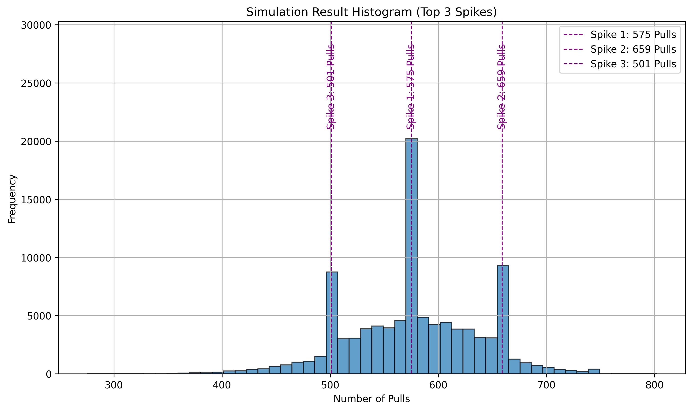

# AFK Arena Dimensional Pull Simulator

This is a simulation tool for the mobile game **AFK Arena**.  
It estimates how many **destiny scrolls (pulls)** you'll need to collect a specified number of **dimensional hero souls**, using real drop rates, pity logic, and milestone bonuses.

It supports:
- Single and dual hero simulations
- Statistical summaries
- Visualizations with spike detection
- Multiprocessing for performance
- Progress bar feedback

## Required Python Packages

Install the following Python packages using `pip`:

```bash
pip install numpy matplotlib tabulate scipy tqdm
```
---
### How to Run
1. Clone the repository to your local machine.
2. Ensure you have Python 3.x installed.
3. Install the required Python packages as listed above.

You will be prompted to:
- Choose 1 or 2 hero simulations
- Enter how many souls each hero needs
- Select how many simulations to run (e.g., 100000)

### Features
- Simulates the number of pulls required to collect dimensional souls.
- Provides a histogram visualization of the simulation results.
- Highlights the top 3 most likely pull counts (spikes).
- Displays best and worst-case scenarios.

### Example Output


---
## License
This project is licensed under the [MIT License](https://opensource.org/licenses/MIT).

You are free to use, modify, and distribute this code for any purpose, with proper attribution.